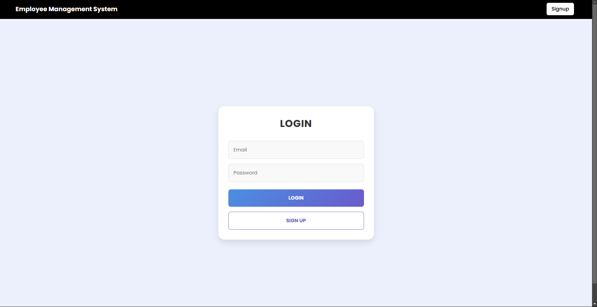
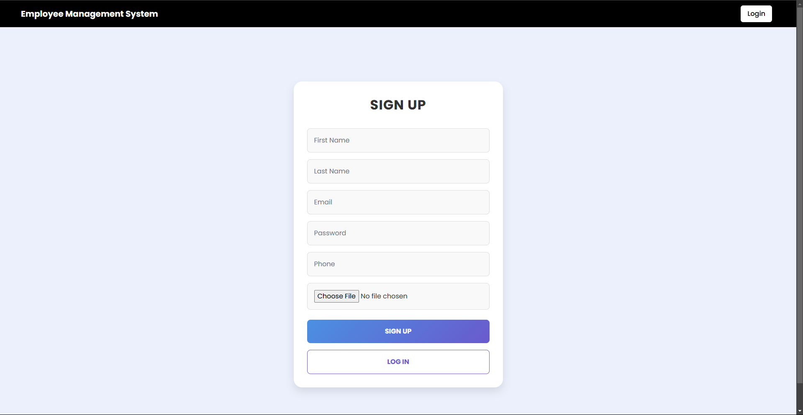
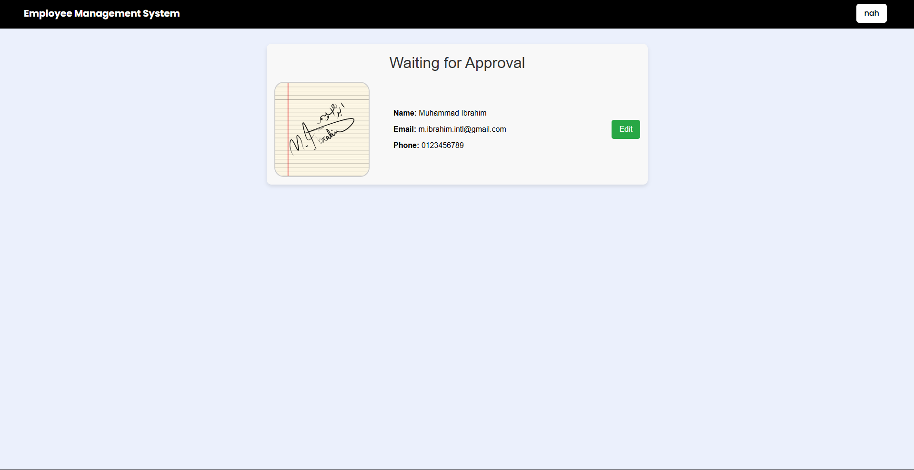
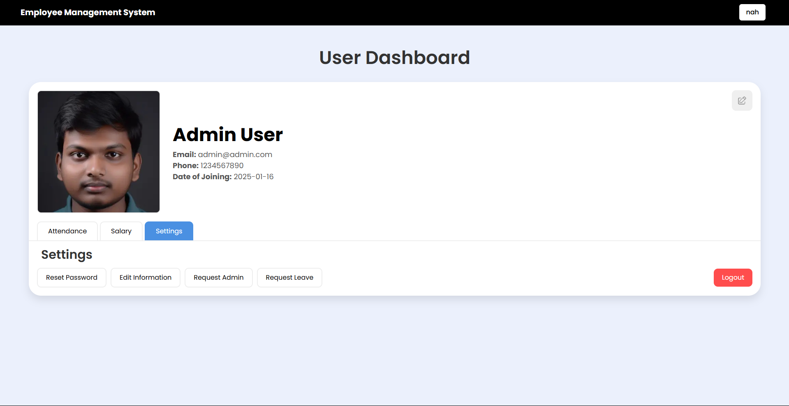

# Employee Management System

An Employee Management System built with **MERN technologies** (MongoDB, Express, React, Node.js) featuring:
- Attendance tracking
- Salary management interface
- Resource sharing
- Leave request system


## Features
- **Employee Profiles:** Add, edit, and manage employee information.
- **Salary Management:** Track and manage employee salaries with bonuses.
- **Attendance Tracking:** Maintain records of employee attendance.
- **Role-based Access Control:** Different access levels for admin and regular users.

## Screenshots
Below are screenshots of the EMS:

- **Login Page:**  
  

- **Sign-Up Page:**  
  

- **Waiting Approval Page:**  
  
  
- **Settings:**  
  

---

## How to Start the Application Locally

If you are not a programmer, follow these simple steps to run the application on your local machine:

### Prerequisites:
1. **Download and Extract the Project Files:**
   - Click the green **Code** button above and select **Download ZIP**.
   - Once downloaded, locate the ZIP file (likely in your "Downloads" folder), right-click it, and select "Extract All" or use any file extraction tool.
   - Choose a location where you want the files to be extracted (e.g., Desktop or Documents).

2. **Install Node.js:**
   - Go to [Node.js](https://nodejs.org/) and download the LTS version.
   - Install it by running the downloaded file and following the installation steps.

3. **Install MongoDB:**
   - Download MongoDB Community Edition from [MongoDB](https://www.mongodb.com/try/download/community).
   - Install MongoDB on your system and ensure the MongoDB server is running (you may need to start it manually from the Services tab on Windows or using terminal commands on Mac/Linux).
   - make a file in server folder and name it `.env` and add `PORT=8000 DATABASE_URL=mongodb://localhost:27017` in it

### Steps to Start the App:
1. **Open the Project Folder:**
   - Navigate to the extracted folder.
   - Right-click on the folder and select "Open in Terminal" (Windows) or "Open in Terminal/iTerm" (Mac/Linux).
     - If this option is unavailable, open a terminal manually and use the `cd` command to navigate to the folder. For example:
       ```bash
       cd path/to/extracted-folder[Probably called Employee-Mangment-MERN]
       ```

2. **Start the Backend:**
   - Navigate to the `Server` folder:
     ```bash
     cd server
     ```
   - Install dependencies:
     ```bash
     npm install
     ```
   - Start the backend server:
     ```bash
     nodemon index.js
     ```
   - Keep this terminal open.

3. **Start the Frontend:**
   - Open a new terminal window (or tab)
   - Navigate to the `client` folder:
     ```bash
     cd path/to/extracted-folder/client
     ```
   - Install dependencies:
     ```bash
     npm install
     ```
   - Start the frontend server:
     ```bash
     npm start
     ```
   - This will automatically open the application in your default browser at `http://localhost:8000`. If it doesnt open automatically open a browser manually and put `http://localhost:8000` in the address bar. (the port may be different,  see the output on the client terminal)

If you face any issues, ensure Node.js and MongoDB are properly installed and running.

---


## Adding a Demo Admin User

To add a demo admin user, follow these steps:

1. Open a terminal and run the following command to connect to the database:
   ```bash
   mongosh
   use EMS
   ```

2. Insert the demo admin user by running the following query:

```
 db.employees.insertMany([ { firstname: "Admin", lastname: "Leader", email: "admin@admin.com", password: "123", role: "admin", allsalary: [ { amount: 5000, bonus: 500, date: new Date("2024-01-01T19:00:00.000Z"), status: "paid" }, { amount: 5000, bonus: 200, date: new Date("2024-02-01T19:00:00.000Z"), status: "paid" }, { amount: 5000, bonus: 300, date: new Date("2024-03-01T19:00:00.000Z"), status: "paid" }, { amount: 5000, bonus: 400, date: new Date("2024-04-01T19:00:00.000Z"), status: "paid" }, { amount: 5000, bonus: 300, date: new Date("2024-05-01T19:00:00.000Z"), status: "paid" }, { amount: 5000, bonus: 200, date: new Date("2024-06-01T19:00:00.000Z"), status: "paid" }, { amount: 5000, bonus: 300, date: new Date("2024-07-01T19:00:00.000Z"), status: "paid" }, { amount: 5000, bonus: 500, date: new Date("2024-08-01T19:00:00.000Z"), status: "paid" }, { amount: 5000, bonus: 400, date: new Date("2024-09-01T19:00:00.000Z"), status: "paid" }, { amount: 5000, bonus: 300, date: new Date("2024-10-01T19:00:00.000Z"), status: "paid" }, { amount: 5000, bonus: 200, date: new Date("2024-11-01T19:00:00.000Z"), status: "paid" }, { amount: 5000, bonus: 500, date: new Date("2024-12-01T19:00:00.000Z"), status: "paid" }], attendance: [ { date: new Date("2024-11-01"), status: "present" }, { date: new Date("2024-11-02"), status: "absent" }, { date: new Date("2024-11-05"), status: "present" }, { date: new Date("2024-11-08"), status: "late" }, { date: new Date("2024-11-15"), status: "present" }, { date: new Date("2024-12-01"), status: "present" }, { date: new Date("2024-12-02"), status: "present" }, { date: new Date("2024-12-03"), status: "absent" }, { date: new Date("2024-12-04"), status: "present" }, { date: new Date("2024-12-05"), status: "present" }, { date: new Date("2024-12-10"), status: "leave" }, { date: new Date("2024-12-11"), status: "present" }, { date: new Date("2024-12-12"), status: "present" }, { date: new Date("2024-12-20"), status: "present" }, { date: new Date("2024-12-25"), status: "absent" }, { date: new Date("2025-01-01"), status: "requested" }, { date: new Date("2025-01-02"), status: "present" }, { date: new Date("2025-01-05"), status: "late" }, { date: new Date("2025-01-10"), status: "present" }, { date: new Date("2025-01-15"), status: "present" }, { date: new Date("2025-01-22"), status: "leave" }, { date: new Date("2025-01-23"), status: "requested" }], isApproved: true, phone: "1234567890", job: "Software Engineer", dateOfJoining: "2024-01-01", image: "/image/john_doe.jpg" }, { firstname: "Jane", lastname: "Smith", email: "jane.s@gmail.com", password: "123456", role: "user", allsalary: [ { amount: 4000, bonus: 300, date: new Date("2024-01-01T19:00:00.000Z"), status: "paid" }, { amount: 4000, bonus: 200, date: new Date("2024-02-01T19:00:00.000Z"), status: "paid" }, { amount: 4000, bonus: 400, date: new Date("2024-03-01T19:00:00.000Z"), status: "paid" }, { amount: 4000, bonus: 300, date: new Date("2024-04-01T19:00:00.000Z"), status: "paid" }, { amount: 4000, bonus: 500, date: new Date("2024-05-01T19:00:00.000Z"), status: "paid" }, { amount: 4000, bonus: 200, date: new Date("2024-06-01T19:00:00.000Z"), status: "paid" }, { amount: 4000, bonus: 300, date: new Date("2024-07-01T19:00:00.000Z"), status: "paid" }, { amount: 4000, bonus: 400, date: new Date("2024-08-01T19:00:00.000Z"), status: "paid" }, { amount: 4000, bonus: 200, date: new Date("2024-09-01T19:00:00.000Z"), status: "paid" }, { amount: 4000, bonus: 300, date: new Date("2024-10-01T19:00:00.000Z"), status: "paid" }, { amount: 4000, bonus: 200, date: new Date("2024-11-01T19:00:00.000Z"), status: "paid" }, { amount: 4000, bonus: 400, date: new Date("2024-12-01T19:00:00.000Z"), status: "paid" }], attendance: [ { date: new Date("2024-11-01"), status: "present" }, { date: new Date("2024-11-03"), status: "late" }, { date: new Date("2024-11-07"), status: "present" }, { date: new Date("2024-11-12"), status: "absent" }, { date: new Date("2024-11-20"), status: "present" }, { date: new Date("2024-12-01"), status: "present" }, { date: new Date("2024-12-05"), status: "present" }, { date: new Date("2024-12-07"), status: "late" }, { date: new Date("2024-12-10"), status: "present" }, { date: new Date("2024-12-15"), status: "present" }, { date: new Date("2025-01-01"), status: "requested" }, { date: new Date("2025-01-05"), status: "present" }, { date: new Date("2025-01-12"), status: "present" }, { date: new Date("2025-01-15"), status: "present" }, { date: new Date("2025-01-22"), status: "leave" }, { date: new Date("2025-01-23"), status: "requested" }], isApproved: true, phone: "0987654321", job: "Product Manager", dateOfJoining: "2024-01-10", image: "/image/jane_smith.jpg" }, { firstname: "Mark", lastname: "Brown", email: "mark.b@gmail.com", password: "123", role: "user", allsalary: [], attendance: [], isApproved: false, phone: "1122334455", job: "Intern", dateOfJoining: "2024-02-01", image: "/images/emily_johnson.jpg" }] );
```

### Admin Account Information
- **Email:** admin@admin.com
- **Password:** 123

### Other Accounts
- **Email:** jane.s@gmail.com
  **Password:** 123456
- **Email:** mark.b@gmail.com
  **Password:** 123

---

---

## How to Use the Application

This section explains the features and how to use the Employee Management System:

### Features:
1. **Login/Sign-Up:**
   - Employees can log in or create an account.

2. **Dashboard:**
   - View  attendance stats, and salary details, 
   - Edit your picture and personal information (is then approved from admin comming soon)
   - View your tasks and deadlines. (comming soon)

3. **Attendance Management:**
   - Toadys Attendence auto mark on login

4. **Salary Management:**
   - View detailed breakdowns of salary, bonuses, and deductions.

5. **Leave Requests:**
   - Submit leave requests with a reason.
   - Admins can approve/reject requests.

6. **Resource Sharing:** (some features not complete yet)(comming soon).
   - Share files and documents with other employees securely.
   - Admins can manage shared resources.
   - Admins can send you resources. 

7. **Employee Management:** 
   - Admins can view and manage employee attendence, salary, bonus and fines.
   - Admins can add, edit, or delete employees.
   - Admins can manage employee roles and permissions.
   - Admins can view employee leave requests and approve/reject them.
   - Admins can approve New Employee registration.

---

## Only for Developers

If you are a developer and want to contribute to or modify this project, here is the information you need:

### Folder Structure:
```
root-directory/
   |-- server/ (the backend)
   |-- client/ (the frontend)
   |-- screenshots/ (app screenshots)
```

### Developer Setup:
1. Clone the repository:
   ```bash
   git clone https://github.com/M-IbrahimDEV/Employee-Management-MERN.git
   ```

2. Install dependencies for both backend and frontend:
   ```bash
   cd server
   npm install

   cd ../client
   npm install
   ```

3. Start MongoDB:
   - Ensure your MongoDB server is running locally or provide a remote MongoDB URI in the backend's `.env` file.

4. Configure Environment Variables:
   Create a `.env` file in the `backend` folder with the following variables:
   ```env
   MONGO_URI=mongodb://localhost:27017
   PORT=8000
   ```

5. Run the App:
   Start both the backend and frontend as described in the **How to Start** section.

### API Endpoints:
Here are some example API routes:
- (sorry i will add later)

### Frontend Routes: ( detailed in client/app.jsx )
- `/` - Login Page
- `/signup` - Sign Up page
- `/waiting-approval` - Employee Dashboard for non approved accounts
- `/userdashoard` - User Dashboard for approved accounts
- `/admin` - Admin Dashboard

---

